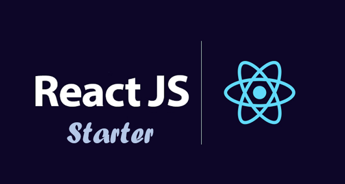

<h1 align="center">React Starter</h1>

<p align="center">
  
</p>

## Description

This is a base architecture for developing React projects. It includes a set of essential features, libraries, and tools to kickstart your frontend development.

## Features

-  Main:

   -  React.js 18.2.0
   -  Typescript 5.0.2
   -  Vite 4.4.0

-  Routing

   -  React Router Dom 6.14.1

-  State Management

   -  Redux Toolkit 1.9.5

-  Conventional Commit:

   -  Commitlint 17.6.6
   -  Husky 8.0.3

-  Data Fetching:

   -  Tanstack / react-query 4.29.19

-  Form Validation:

   -  Formik 2.4.2
   -  Yup 1.2.0

-  UI Management:

   -  Tailwind CSS 3.3.2
   -  Storybook 7.0.27

-  Unit Testing

   -  vite 4.4.1
   -  @testing-library/react 14.0.0
   -  @testing-library/jest-dom 5.17.0
   -  happy-dom 10.5.2

## Usage

### Running Locally

To run the project locally, use the following command:

```shell
npm run dev
```

### Linking the Code

To link the code, use the following command:

```shell
npm run lint
```

### Checking Code Format

To check the format of the code, use the following command:

```shell
npm run format:check
```

### Formatting the Code

To format the code, use the following command:

```shell
npm run format
```

### Committing the Code

To commit the code using conventional commit messages, use the following command:

```shell
npm run commit
```

### Building

To build the project, use the following command:

```shell
npm run build
```

Feel free to modify the project according to your needs and start building amazing React applications!

## License

This project is licensed under the MIT License. See the [LICENSE](./LICENSE) file for more details.
